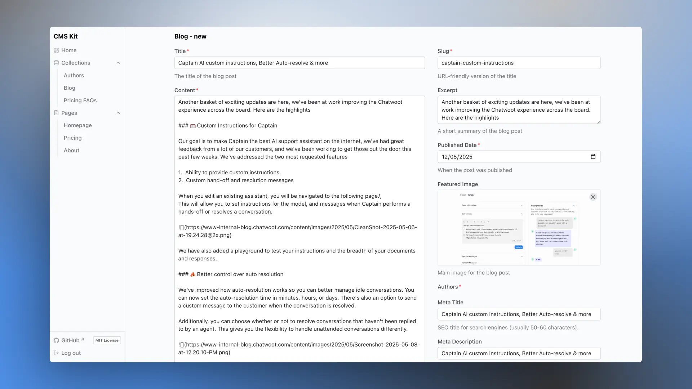

# cms-kit

**cms-kit** is a lightweight, open-source, headless CMS built entirely on the Cloudflare stack. It allows you to define your content structures using a zod v4 based schema builder and automatically generates a user interface for content management. Ideal for projects where you want full control over your content model and a simple, performant backend.

## Key Features

*   **Simplified Schema Definition:** Define your content structures using a zod based schema builder
*   **Automatic UI Generation:** A dashboard UI is automatically generated based on your schemas for intuitive content management.
*   **Single Entries & Collections:** Supports both one-off content pieces and groups of similar content.
*   **Markdown Support:** Built-in Markdown editor with preview and image upload capabilities.
*   **Cloudflare Native:** Runs entirely on Cloudflare Workers, D1 (database), and R2 (image storage).
*   **Simple Authentication:** Secure dashboard access with a password set via environment variables.
*   **Read-Only API:** Secure, token-based API for fetching content for your applications.
*   **Deployment Hooks:** Built-in support for triggering deployments on content changes via hooks for Vercel, Cloudflare Pages, and Netlify, ensuring your frontend stays in sync with your content updates.
*   **Open Source & Customizable:** MIT licensed and distributed as a GitHub template, allowing full customization.

## Tech Stack

*   **Frontend/Dashboard:** [Nuxt 3](https://nuxt.com/) + [Nuxt UI](https://ui.nuxt.com/) + [Pinia](https://pinia.vuejs.org/)
*   **Backend:** [Cloudflare Workers](https://workers.cloudflare.com/)
*   **Database:** [Cloudflare D1](https://developers.cloudflare.com/d1/)
*   **Image Storage:** [Cloudflare R2](https://developers.cloudflare.com/r2/)
*   **Schema Validation (Internal):** [Zod](https://zod.dev/)
